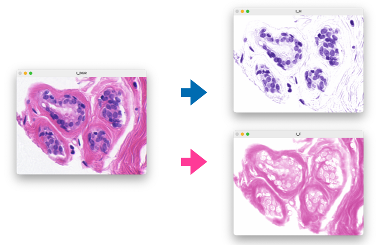
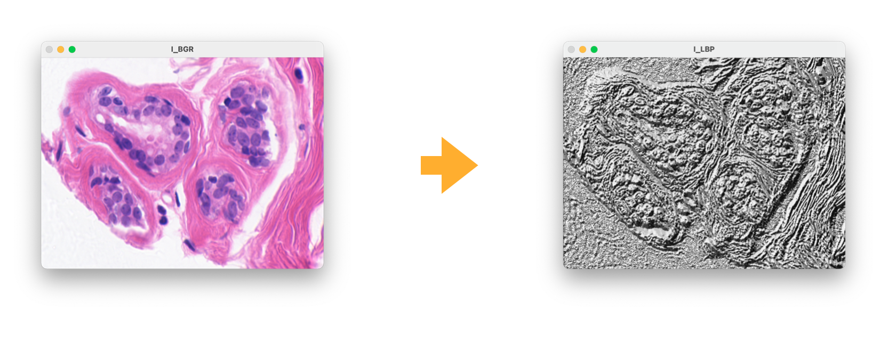
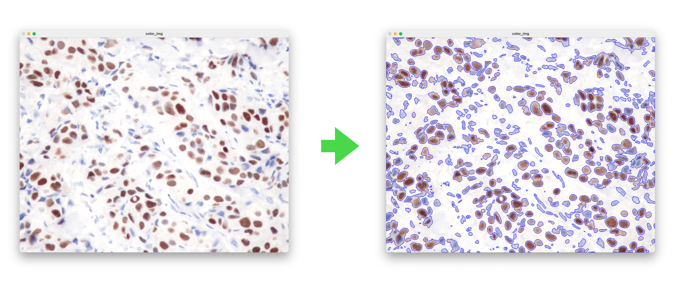
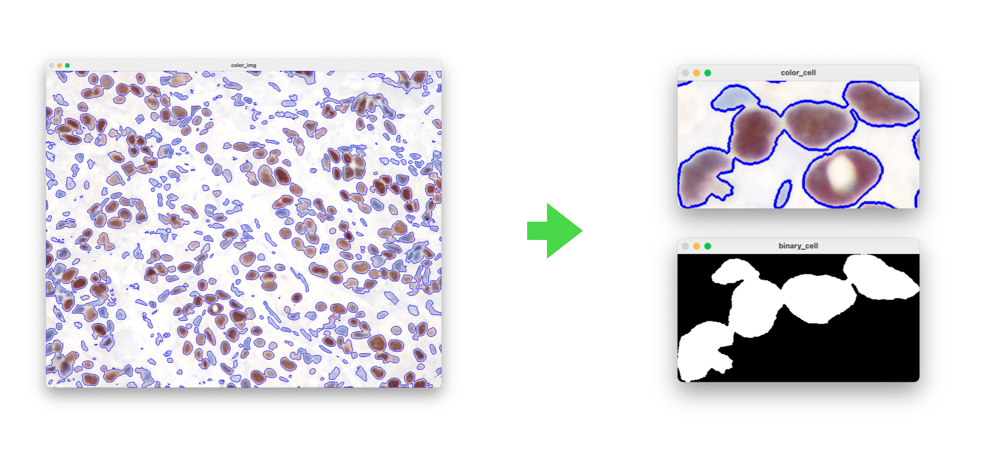

# PyPath


[](https://badge.fury.io/py/python-patho)
[](http://perso.crans.org/besson/LICENSE.html)

Python library for pathology image analysis


This project is part of my PhD thesis to analyse histopathological images. Especially, the breast cancer hematoxylin and eosin-stained images
from [BreCaHAD: a dataset for breast cancer histopathological annotation and diagnosis](https://figshare.com/articles/dataset/BreCaHAD_A_Dataset_for_Breast_Cancer_Histopathological_Annotation_and_Diagnosis/7379186)

## It supports:
- Optical density transform
- Color deconvolution
local_binary_patternslocal_binary_patterns
## Dependencies
- [OpenCV](https://opencv.org)
- [scikit-image](https://scikit-image.org)
- [spams](http://spams-devel.gforge.inria.fr)
- [numpy](https://numpy.org)
- [tqdm](https://tqdm.github.io)
- [staintools](https://github.com/Peter554/StainTools)

## Installation
```shell
$ pip install python-patho
```

## How to run
```shell
$ python demo.py
```


## Basic Usage
#### *Try your first PyPath program*

```python
>>> from pypath.transform import convert_RGB_to_OD
>>> import cv2
>>> I_BGR = cv2.imread('images/he.png')
>>> I_RGB = cv2.cvtColor(I_BGR, cv2.COLOR_BGR2RGB)
>>> I_OD  = convert_RGB_to_OD(I_RGB)
```


```python
>>> from pypath.stain_extractor import HE_color_decon
>>> I_H, I_E = HE_color_decon(I_RGB)
```



```python
>>> from pypath.texture import cal_lbp
>>> I_LBP    = cal_lbp(I_BGR)
```



```python
>>> from pypath.utils import threshold
>>> from pypath.transform import mopho_process
>>> 
>>> src_path  = 'IHC_IMAGE.jpg'
>>> color_img = cv2.imread(src_path)
>>> color_img = staintools.LuminosityStandardizer.standardize(color_img)
>>> 
>>> gray        = cv2.cvtColor(color_img, cv2.COLOR_BGR2GRAY)
>>> gray        = threshold(gray, 220)
>>> cells_image = mopho_process(gray, gen_kernels())
>>> 
>>> contours, hierarchy = cv2.findContours(cells_image, cv2.RETR_TREE, cv2.CHAIN_APPROX_NONE)
>>> cv2.drawContours(color_img, contours, -1, (255,0,0), 3)
```



```python
>>> from pypath.cell_processor import select_cell
>>> color_cell, binary_cell    = select_cell(color_img, contours, 161)
```


## License
[GNU Affero General Public License v3.0](LICENSE)