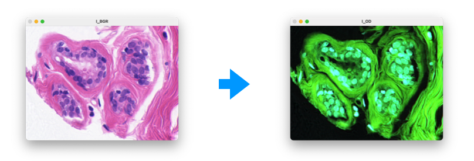

# PyPath
Python library for pathology image analysis

This project is part of my PhD thesis to analyse histopathological images. Especially, the breast cancer hematoxylin and eosin-stained images
from [BreCaHAD: a dataset for breast cancer histopathological annotation and diagnosis](https://figshare.com/articles/dataset/BreCaHAD_A_Dataset_for_Breast_Cancer_Histopathological_Annotation_and_Diagnosis/7379186)

## It supports:
- Optical density transform

## Dependencies
- [OpenCV](https://opencv.org)
- [scikit-image](https://scikit-image.org)

## Installation
```shell
$ git clone https://github.com/superizer/pypath.git
$ pip install .
```

## How to run
```shell
$ python demo.py
```


## Basic Usage
#### *Try your first PyPath program*

```python
>>> from pypath.transform import convert_RGB_to_OD
>>> import cv2
>>> I_BGR = cv2.imread('images/he.png')
>>> I_RGB = cv2.cvtColor(I_BGR, cv2.COLOR_BGR2RGB)
>>> I_OD  = convert_RGB_to_OD(I_RGB)
```


## License
[GNU Affero General Public License v3.0](LICENSE)